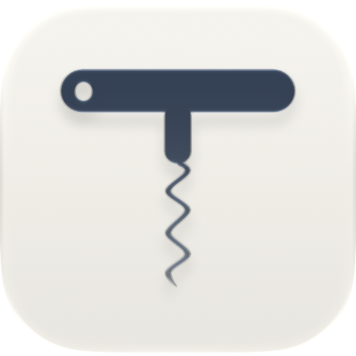

# Corkscrew

[](https://github.com/Prateek-Srivastav/corkscrew/actions/workflows/ci.yml) [](LICENSE)

A native macOS app (Swift 6, SwiftUI) that runs Windows games and launchers on Apple Silicon Macs. It builds its own Wine runtime, picks a graphics translation layer per game, keeps games in separate Wine prefixes ("bottles"), and can run untrusted programs inside a macOS sandbox.

It's developed and tested on a 14" MacBook Pro (M4, 16 GB, macOS 27), and contributions are welcome (see [Contributing](#contributing)). It runs games you own through their normal stores and launchers. It doesn't bypass DRM or copy protection, and won't.

## Install

You need an Apple Silicon Mac with macOS 26 or 27, and about 3 GB of free space for the app, its Wine runtime and a bottle, plus your games.

1. Download `Corkscrew-<version>.dmg` from the [latest release](https://github.com/Prateek-Srivastav/corkscrew/releases/latest). Open it and drag Corkscrew to Applications.
2. Open Corkscrew. It isn't signed with an Apple Developer ID yet, so macOS blocks it the first time:
   - Click **Done** in the warning.
   - Open **System Settings → Privacy & Security**, scroll down, and click **Open Anyway** next to the message about Corkscrew. Confirm with your password.

   You only do this once.
3. Click **Set Up Corkscrew**. It does everything in one go, in about two minutes on a fast connection:
   - installs **Rosetta** if your Mac doesn't have it yet (macOS asks for your password); the Wine runtime is made for Intel Macs and runs through it;
   - downloads the **Wine runtime with its graphics translators**, about 300 MB: D3DMetal from Apple's Game Porting Toolkit for DirectX 12, DXMT and DXVK for DirectX 10/11. The app checks it against a SHA-256 built into the app before installing it;
   - creates a bottle called "Games";
   - installs **Steam**, which downloads the rest of itself (about 240 MB).
4. Open Steam from the Library, sign in, and install your games. The [games tested](#games-tested) with Corkscrew are already in the Library, and their button opens them in Steam.

**About Rosetta:** Apple plans to limit Rosetta after macOS 27. Corkscrew's runtime needs it, so it supports macOS 26 and 27 for now; an ARM64 runtime is on the [roadmap](#roadmap).

To build it yourself instead, or to contribute, see [Building](#building).

## What works

| Area | Status |
|---|---|
| Wine runtime | CodeWeavers' open-source Wine (winecx 26.3, Wine 11 base), built from source for x86_64 and run under Rosetta 2, using Wine's new WoW64 mode |
| Graphics backends | D3DMetal (Apple's Game Porting Toolkit 3.0), DXMT, DXVK with MoltenVK, and WineD3D, switchable per launch; DX11/DX12 smoke test passes 6/6 |
| MetalFX | Games' DLSS option runs as MetalFX upscaling through D3DMetal (DX12) or DXMT (DX11; not yet tested in a game) |
| Retina mode | Per game: the game sees either the 1512×982 point desktop or the panel's full 3024×1964 pixels |
| Steam | Installs, signs in, downloads and launches games; its installed games show up in the library automatically |
| Rockstar Games Launcher | Starts, signs in (Social Club), and launches games |
| Isolated bottles | Programs run in a macOS sandbox (no access to your home folder, network off by default); DX11 and DX12 render inside it |
| SwiftUI app | Library, bottles, setup, per-game settings, logs, Play/Stop, Finder "Open With" for `.exe`/`.msi` |
| Performance overlay | Apple's Metal HUD, plus our own panel with CPU, RAM, GPU usage and GPU memory |
| Game Mode | macOS Game Mode turns on for fullscreen games, as for native ones (engine pack 26.3.0-3 and later) |

### Games tested

| Game | Path | Result |
|---|---|---|
| **Red Dead Redemption 2** | Steam → Rockstar Games Launcher → DX12 on D3DMetal 3.0 | Plays, launched end to end from the app, in Fullscreen at the 1512×982 desktop. Starts with the tested settings: mostly Low and Medium with High textures, and DLSS as MetalFX upscaling. |
| **Black Myth: Wukong Benchmark Tool** | Steam, DX12 + MetalFX (or DX11) on D3DMetal 3.0 | Runs. Best results: 50 FPS average at 1512×982 (Medium, MetalFX 59%), or 33 FPS at Retina 3024×1964 with a much sharper image. |
| **Emily is Away** | 32-bit, DX11 on DXVK | Runs |

## How it works

```
Corkscrew.app (SwiftUI)                    gamecore-cli
            \                              /
             GameCore (Swift package)
             ├─ Inspect     PE parser: imports, DX version, engine, anti-cheat markers, icons
             ├─ Graphics    picks a backend: 64-bit DX12/11 → D3DMetal, other DX11/10 → DXMT, else WineD3D
             ├─ Engines     installed Wine runtimes and graphics components
             ├─ Bottles     create, clone (APFS), update, reset Wine prefixes
             ├─ Isolation   Seatbelt sandbox profile + prefix hardening
             ├─ Stores      Steam and Rockstar Games Launcher support
             ├─ Launch      plan → run → log → clean up
             └─ Performance per-bottle CPU/RAM/GPU sampling
                     │
             winecx 26.3 (x86_64, Rosetta 2)
                     │
   D3DMetal (GPTK) · DXMT · DXVK + MoltenVK · WineD3D  →  Metal
```

- **Graphics DLLs switch per launch.** The backend DLLs live outside Wine's own DLL folder. Each launch points `WINEDLLPATH` at the chosen backend and sets the matching environment, so one bottle can run different games on different backends.
- **Tuned for speed.** Every launch uses msync (Mach-semaphore synchronisation: waiting on a signaled event takes 0.1 µs instead of 10 µs through the wineserver) and no Wine debug output. Fullscreen games in standard bottles get macOS Game Mode. Steam's in-game overlay stays out of games unless a game's settings turn it on: it wraps the game's swap chain and draws every frame. DXVK compiles shaders in the background and MoltenVK submits work on its own thread. DXMT and DXVK keep their shader caches in each game's cache folder, which isolated bottles can write too. `scripts/bench.sh` measures the overhead.
- **Bottles stay current.** Each bottle remembers which runtime modules it was booted with, and is updated (`wineboot --update`) when the runtime changes.
- **Isolated bottles** run Wine, the wineserver and setup commands under a generated sandbox profile:
  - Nothing outside the bottle and its logs is writable, so programs can't plant files in `/Applications`, `/opt/homebrew` or anywhere else you'd later run them from. The runtime and graphics components are read-only.
  - Home, `/Users` and `/Volumes` can't be read either.
  - Programs can only be started from the runtime. They can't open apps or URLs through LaunchServices, or submit launchd jobs, either of which would run outside the sandbox.
  - Network, AppleEvents, keychain and clipboard are blocked.
  - The rest of the system stays readable (macOS itself, and apps' files outside your home folder), because Metal, Rosetta and audio need much of it.
  - Drive links that point outside the bottle are removed, user folders are real folders, and there's a clean snapshot for "Reset to clean".

## What we built, step by step

### M0: the runtime
- Scripts that build Wine's x86_64 dependencies (FreeType, GnuTLS, Nettle, SDL2) and winecx 26.3, with every download pinned by version and SHA-256 (`scripts/runtime-pins.env`).
  - Libraries are relocatable through `@rpath`.
  - The loader is marked as a game for macOS Game Mode.
- Installing DXMT, DXVK-macOS and D3DMetal (taken from Apple's Game Porting Toolkit disk image) as switchable backends.
- DX11/DX12 clear-screen test programs and a smoke test across all backends.

### M1: the GameCore library and CLI
- PE inspection (imports, delay-imports, runtime-loaded D3D DLLs, game engine, anti-cheat markers, icons) and automatic backend choice.
- Bottles: create, clone, import, reset, and update automatically when the runtime changes.
- Isolated bottles:
  - A sandbox profile, verified with canary files that a standard bottle can read and an isolated one can't.
  - Program output reaches its log through a pipe, because the sandbox blocked files outside each launch's own folder.
- Runtime store (SHA-256-checked archives, or APFS clones of a local build), and a GPTK importer that mounts Apple's disk images and stages D3DMetal.
- Per-game Retina mode, handling the fact that Wine fixes display sizes for a whole bottle session.
- Steam support:
  - A wrapper for Steam's built-in browser (`--disable-gpu --single-process`). Without it Steam's window is black and its network service fails.
  - Library entries for each installed game, with tested settings per game.
- A performance overlay that sits over fullscreen games, is click-through, and quits with the game.

### M2: the app
- SwiftUI app:
  - Library grid with icons, drag-and-drop and hover Play, plus Bottles, Setup and per-game settings.
  - A log viewer per launch that follows a running game.
  - `corkscrew://launch/<id>` and `corkscrew://stop/<id>` links.
- Zero setup in a dev checkout: the app finds the built runtime and components, and creates a "Games" bottle.
- Steam games that are uninstalled keep their library entry as "Not Downloaded"; Play opens their Steam store page.

### Red Dead Redemption 2
Getting RDR2 to run took several fixes, all of them applied automatically before launch:
- **Rockstar Games Launcher wouldn't start.** It draws with Direct2D, which needs Wine's own Direct3D. Games started from Steam inherit D3DMetal.
  - Fix: the launcher and its Social Club helper get Wine's Direct3D DLLs, rendering through OpenGL, while the game keeps D3DMetal.
  - D3DMetal's GPU vendor libraries are turned off for the launcher; they crashed it once signed in.
- **Social Club pages were white** (sign-in, prompts, the hidden launcher window).
  - Cause: Social Club is Chromium, whose GPU process draws into another process's windows, and Wine's macOS driver drops that drawing.
  - Fix: a runtime patch starts Social Club with `--in-process-gpu`, so it draws in its own process. The app warns when the runtime was built without the patch.
- **DX12 on D3DMetal.** The game's settings are set to DX12 before each launch. Vulkan would go through MoltenVK instead.
- **Tested graphics settings from the start.** Before the game's first launch, the app writes the settings tested here: DirectX 12, Fullscreen at the Mac's desktop size, mostly Low and Medium quality with High textures, and DLSS, which runs as MetalFX. After that they're the player's own to change in game. They're in `Packages/GameCore/Sources/GameCore/Stores/RDR2Settings.swift`.
- **Small window in the middle of the screen** (if you switch to Windowed Borderless).
  - In Windowed Borderless, RDR2 sizes its window from its resolution setting, and its defaults pick a size smaller than the desktop.
  - Fix: the app sets that resolution to the desktop's size.
- **Launch and quit like a native game.**
  - A Steam game's launch follows the game's own processes rather than `steam.exe`.
  - When the game quits, the app closes what it started: Steam and the launcher.
  - It closes the Rockstar launcher with a hard kill, because a normal quit signs you out and breaks automatic sign-in.

## Building

To work on Corkscrew, or to run it without the DMG, build it from source. The scripts do the work; most of the time goes into compiling Wine.

### You need

- An Apple Silicon Mac with macOS 26 or later.
- About 8 GB of free disk space. Everything goes into the repository's `build/` folder.
- Rosetta 2, which runs the x86_64 Wine:

  ```bash
  softwareupdate --install-rosetta --agree-to-license
  ```

- Xcode 26 or later, from the App Store. Open it once, or run `sudo xcodebuild -runFirstLaunch`, to finish its setup.
- [Homebrew](https://brew.sh).
- Optional, but needed for DirectX 12 games such as Red Dead Redemption 2: **Game Porting Toolkit 3.0** from [Apple's Game Porting Toolkit page](https://developer.apple.com/games/game-porting-toolkit/). The download needs a free Apple Account; Corkscrew takes D3DMetal from the `.dmg`. (The DMG release includes D3DMetal; building from source, you download it yourself.)

### Steps

1. Get the code:

   ```bash
   git clone https://github.com/Prateek-Srivastav/corkscrew.git
   ```

   ```bash
   cd corkscrew
   ```

2. Install the build tools (mingw-w64, bison, flex, XcodeGen and others, through Homebrew):

   ```bash
   scripts/bootstrap.sh
   ```

3. Build Wine's x86_64 libraries (FreeType, GnuTLS, Nettle, SDL2):

   ```bash
   scripts/build-deps.sh
   ```

4. Build the Wine runtime into `build/runtime/winecx-26.3.0` (about 1.4 GB). This is the long step. If it stops, run it again: it continues where it left off.

   ```bash
   scripts/build-runtime.sh
   ```

5. Stage the graphics translators (DXMT, DXVK, and D3DMetal from your toolkit download) into `build/components`. Use your `.dmg`'s path; leave it out to skip D3DMetal for now.

   ```bash
   scripts/install-components.sh ~/Downloads/Game_Porting_Toolkit_3.0.dmg
   ```

6. Build the app:

   ```bash
   scripts/build-app.sh Debug
   ```

7. Open the app. It's built inside the repository, at `build/DerivedData/Build/Products/Debug/Corkscrew.app`:

   ```bash
   open build/DerivedData/Build/Products/Debug/Corkscrew.app
   ```

   To find it again later, show it in Finder and drag it to the Dock:

   ```bash
   open -R build/DerivedData/Build/Products/Debug/Corkscrew.app
   ```

   Open it from there the first time; don't move it to Applications first. On its first launch it sets itself up by looking through the folders above it for the repository's `build/` folder (see [First run](#first-run)). After that, it has its own copy of the runtime, so you can copy it to Applications if you like. Copy it again after each rebuild.

Every download is checked against the SHA-256 in `scripts/runtime-pins.env`, so a build stops if anything doesn't match.

### Updating

After `git pull`:
- Run `scripts/build-app.sh Debug` again.
- If `scripts/build-runtime.sh` or `scripts/runtime-pins.env` changed, rebuild the runtime too. Delete `build/src/crossover-*` first, because Wine's source is extracted and patched once. Then run `scripts/install-components.sh` again: the rebuild removes DXMT's `winemetal` from the runtime, and DXMT games fail in new bottles without it. The app picks up the new runtime the next time it opens, and bottles update to it at their next launch.

### Tests

```bash
scripts/test.sh
```

The tests don't need the Wine runtime. For the graphics smoke test across backends, run `scripts/make-fixtures.sh`, then `scripts/smoke.sh`.

To measure what the translation layer costs, run `scripts/bench.sh` after the smoke test. It times common Win32 calls under Wine, and the CPU cost of D3D11 draw calls on DXMT, D3DMetal and DXVK, with the settings the app launches games with. On the M4 it shows:
- Wine system calls take 50–75 ns, and a thread wake-up round trip about 5 µs with msync (20 µs without it).
- At 100,000 draws per frame: D3DMetal 63–80 FPS, DXMT 58 FPS, DXVK 45 FPS (36 FPS before MoltenVK's asynchronous submits were turned on).

## Using it

### First run

1. **Open the app and set it up.** A downloaded copy: click **Set Up Corkscrew** (see [Install](#install)). A copy built from source, opened from where it was built (step 7 above), adds the runtime and graphics components from `build/` and creates the "Games" bottle by itself; click **Set Up Corkscrew** to add Steam.
2. **Sign in to Steam and install a game.** Press Play on Steam, sign in, and install a game as you would on Windows. Installed games appear in Corkscrew's Library on their own. The tested games are listed under **Not Downloaded** from the start; their button opens their page in Steam.
4. **Play.** Press Play on the game. Corkscrew picks a graphics backend from the game's DirectX version. You can change it in the game's settings panel.

If something doesn't work, check [Known issues](#known-issues), then the game's log, under **Logs** in its panel.

### More

- Other programs: drag in an `.exe` or `.msi`, or use Finder's "Open With". **Run Once** suits installers, and **Add to Library** suits games.
- Each game's panel has the graphics backend, MetalFX, Retina mode, the Metal HUD, the performance overlay, Steam's overlay (off by default), launch arguments and logs. Games started from Steam's own window get the settings Steam was started with.
- For programs you don't trust, create an **isolated** bottle under Setup (New Bottle…). It runs them in a macOS sandbox with no access to your home folder, and network off by default.
- To try another D3DMetal version, import its Game Porting Toolkit disk image under Setup → Advanced.
- The app keeps its data in `~/Library/{Application Support,Logs,Caches}/Corkscrew`. Pass `-DataRoot <folder>` to keep everything in one folder instead.

### The CLI

For scripting and debugging without the app. Build it with `swift build` in `Packages/GameCore`, and run it from the repository root:

```bash
Packages/GameCore/.build/debug/gamecore-cli bottle create games
```

```bash
Packages/GameCore/.build/debug/gamecore-cli inspect /path/to/Game.exe
```

```bash
Packages/GameCore/.build/debug/gamecore-cli run --bottle games --backend d3dmetal --metalfx --hud /path/to/Game.exe
```

Other `run` options:
- `--retina`
- `--overlay`
- `--d3dmetal 3.0|4.0b2`
- `--verbose`
- `--env KEY=VALUE`

Use `--bottle <name>` with a bottle created with `bottle create <name> --isolated` to run a program sandboxed.

## Repository layout

| Path | Contents |
|---|---|
| `App/` | The SwiftUI app |
| `Packages/GameCore/` | The `GameCore` library, `gamecore-cli`, `perf-overlay`, and tests |
| `scripts/` | Runtime, dependency, component and app builds; tests; smoke test; benchmark |
| `tools/steamwebhelper-wrapper/` | The wrapper that makes Steam's browser work under Wine |
| `fixtures/` | DX11/DX12 test programs, benchmarks and a display-mode reporter |
| `project.yml` | XcodeGen spec for the app (the `.xcodeproj` is generated) |
| `.github/` | CI, issue and pull request templates, code owners, Dependabot |
| `build/` | Downloads, sources, the runtime, components and dev data (not in git) |
| `dist/` | Release output: the engine pack with its source, and the DMG (not in git) |

## Known issues

- **Isolated bottles use `sandbox-exec`**, which Apple has deprecated. It works on macOS 26 and 27, and the tests check the sandbox on every run, but a future macOS could change or remove it.
- **RDR2 crashes after changing graphics settings in game.** It exits with "No DirectX 12 adapter or runtime found" a few minutes later, seen with the Ultra preset and with resolution changes. Workaround: change settings, then quit and relaunch.
- **The Rockstar launcher sometimes can't reach its library service** ("Failed to connect to the Rockstar Games Library Service"). It's intermittent; closing it and playing again works.
- **Networks that intercept TLS** break Steam downloads and push the Rockstar launcher into offline mode.
- **FSR 3 Frame Generation crashes DX12 games on D3DMetal.** Keep it off; DLSS (MetalFX) upscaling works.
- **GPTK 4.0 beta 2 draws Wukong's textures as blocks.** It's an Apple bug, so stable 3.0 is the default.
- **Steam's own UI looks half-size in Retina mode**, because Windows DPI stays at 96. Games aren't affected.
- **D3DMetal's shader cache** is shared by every bottle and GPTK version.

## Roadmap

- **M3:** game profiles.
- **Rest of the isolation work:** a blocked-actions panel and a network-block check.
- **M4:** verify shortcuts, controllers.
- **M5:** Epic Games and Battle.net launchers.
- **M6:** an ARM64 Wine with FEX for x86 emulation, before Rosetta 2 is retired.
- **Distribution:** Developer ID signing and notarization, so the app opens without "Open Anyway", and automatic updates.

## Contributing

Bug fixes, game reports and new launcher support are welcome:
- Read [CONTRIBUTING.md](CONTRIBUTING.md) first.
- Report how a game runs with the **Game report** issue form, and ask questions in [Discussions](https://github.com/Prateek-Srivastav/corkscrew/discussions).
- Report security problems privately, as described in [SECURITY.md](SECURITY.md).
- Everyone taking part follows the [Code of Conduct](CODE_OF_CONDUCT.md).

## License

Corkscrew is free software: you can redistribute it and modify it under the terms of the [GNU General Public License](LICENSE), version 3 or (at your option) any later version. It comes with no warranty.

## Credits and licenses

This repository only contains Corkscrew's own code. The build scripts download each third-party component at build time, check it against the SHA-256 in `scripts/runtime-pins.env`, and keep everything under `build/`, which isn't in git.

The DMG doesn't include them either. On first launch the app downloads an **engine pack**: the Wine runtime built by these scripts, D3DMetal, DXMT and DXVK, with their licenses. `scripts/package-engine.sh` makes it, and each pack is published as a `runtime-*` release together with the source code of everything in it.

Each component keeps its own license:

| Component | Used for | License |
|---|---|---|
| [Wine](https://www.winehq.org), from CodeWeavers' published source (winecx 26.3.0) | The Windows compatibility layer | LGPL 2.1 or later |
| [DXMT](https://github.com/3Shain/dxmt) 0.80 | Direct3D 10/11 → Metal | MIT |
| [DXVK-macOS](https://github.com/Gcenx/DXVK-macOS) 1.10.3 | Direct3D 9/10/11 → Vulkan | zlib/libpng |
| [MoltenVK](https://github.com/KhronosGroup/MoltenVK) 1.4.2 | Vulkan → Metal | Apache 2.0 |
| [Wine Mono](https://gitlab.winehq.org/mono/wine-mono) 10.4.1 | .NET support in bottles | MIT, with some parts under other open-source licenses |
| [FreeType](https://freetype.org) 2.13.3 | Fonts | FreeType License or GPL 2 (dual) |
| [GnuTLS](https://gnutls.org) 3.8.13 | TLS | LGPL 2.1 or later |
| [Nettle](https://www.lysator.liu.se/~nisse/nettle/) 3.10 and GMP (from the Wine source) | Cryptography for GnuTLS | LGPL 3 or GPL 2 (dual) |
| [SDL2](https://libsdl.org) 2.32.10 | Game controllers | zlib |
| [Swift Argument Parser](https://github.com/apple/swift-argument-parser) | `gamecore-cli` | Apache 2.0 |
| D3DMetal, from Apple's [Game Porting Toolkit](https://developer.apple.com/games/game-porting-toolkit/) 3.0 | Direct3D 11/12 → Metal | Apple's license (`Apple-License.rtf`, with `Apple-Acknowledgements.rtf`). Not open source, and not covered by Corkscrew's GPL. The license allows redistributing the toolkit's `redist` components only for non-commercial purposes, with Apple's notices: the free engine pack includes them, and anything that sells Corkscrew must leave them out. |

**Our changes to Wine** are applied as patches by `scripts/build-runtime.sh`, so the exact source of any runtime built here is the published Wine source plus that script:
- the loader's Info.plist: its own bundle identifier and the Game Mode keys;
- starting programs from an app bundle with those keys, so Game Mode turns on (it ignores executables outside a bundle);
- an opt-out of the loader's re-exec link, for sandboxed bottles;
- starting Rockstar's Social Club with `--in-process-gpu`.

Steam, Rockstar Games, Red Dead Redemption, Black Myth: Wukong, DirectX, DLSS, FSR, Metal and other names are trademarks of their owners. Corkscrew isn't affiliated with or endorsed by any of them.
